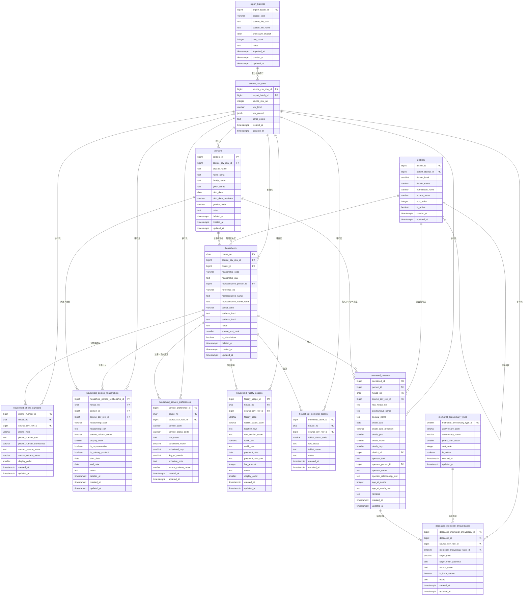
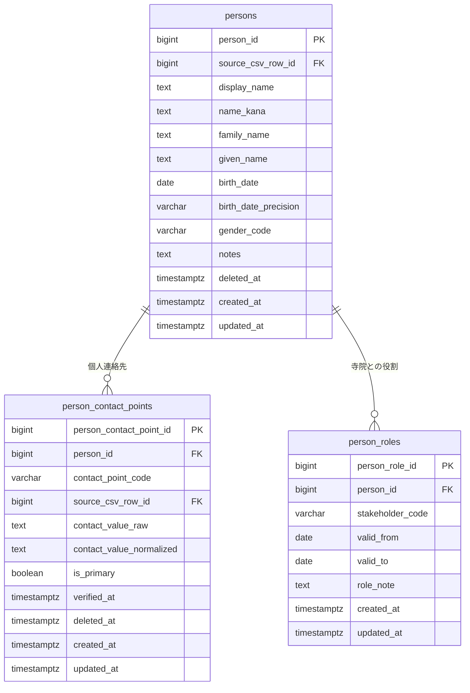
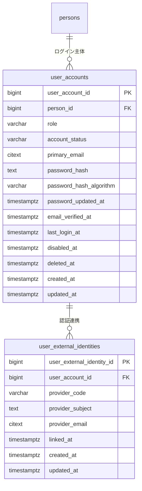

# ER図

## 設計要点

- 現スコープは「檀信徒管理」「過去帳」「将来の人中心拡張」であるため、固定値の小マスタと本格RBACは当面持たない。YAGNIに基づき、少数で固定的な区分・状態は各参照元テーブルのコード列とCHECK制約で表現する。
- 最終テーブルは17テーブルとする。人中心モデルの骨格、世帯管理、過去帳、認証、CSV移行監査は維持し、過剰分離していた小マスタとRBAC関連テーブルを廃止する。
- 「人」は `persons`（個人マスタ）を中心に表現する。檀家世帯の代表者・家族・前戸主・連絡先人物、檀家ではない参拝者・ボランティア・寄進者・業者・僧侶・寺族などもすべて `persons` に登録できる。
- `households` は既存の檀信徒名簿ベースの世帯管理として維持する。`households.house_no` は引き続き4桁家番の主キーとし、檀家・信徒などの関係区分は `relationship_code` で持つ。
- 旧 `household_related_people` 相当の情報は、物理テーブルとしては `persons` + `household_person_relationships` に統合する。世帯内関係は `household_person_relationships.relationship_code` で表現し、必要に応じて互換ビュー `household_related_people` を提供する。
- 人が寺院との関係で果たす役割は `person_roles.stakeholder_code` で表現する。檀家、参拝者、ボランティア、寄進者、業者、僧侶、寺族などの複数付与と期間管理を可能にする。
- アプリケーション権限は `user_accounts.role` の単一ロールで管理する。将来、権限が複雑化した段階でロール・権限・付与履歴のテーブルへ展開できる。
- 認証情報では生パスワードを保持しない。メール/パスワード認証ではパスワードハッシュとハッシュ方式を保持し、OAuth等は `user_external_identities.provider_code` で認証プロバイダを識別する。
- 施設は正規化済み区画マスタを切り出さず、当面は `household_facility_usages` に施設種別コード、状態コード、区画原表記、幅、入金、代金、備考をまとめる。元データ清掃後に区画マスタが必要になった場合のみ分離する。
- `household_memorial_tablets` は位牌が墓地・納骨堂区画と性質が異なるため単独維持する。
- `deceased_memorial_anniversaries` は故人ごとの年忌対象年を表す記録で、年忌種別、対象年、原表記を保持する。年忌種別は順序・没後年数を持つため `memorial_anniversary_types` として維持する。
- CSV移行監査のため、`import_batches` と `source_csv_rows` は維持する。正規化できない値、原表記、特殊家番、家番空欄行は引き続き原行JSONまたは `raw_*` カラムへ残す。
- 個人情報・認証情報を扱うテーブルには、必要に応じて `deleted_at` を持たせ、退会・論理削除・表示抑止を可能にする。全テーブルに `created_at`、`updated_at` を持たせる。

## Mermaid ER図

### 檀信徒・過去帳・移行基盤

### 人・連絡先・ステークホルダー役割

### 認証・アカウント

