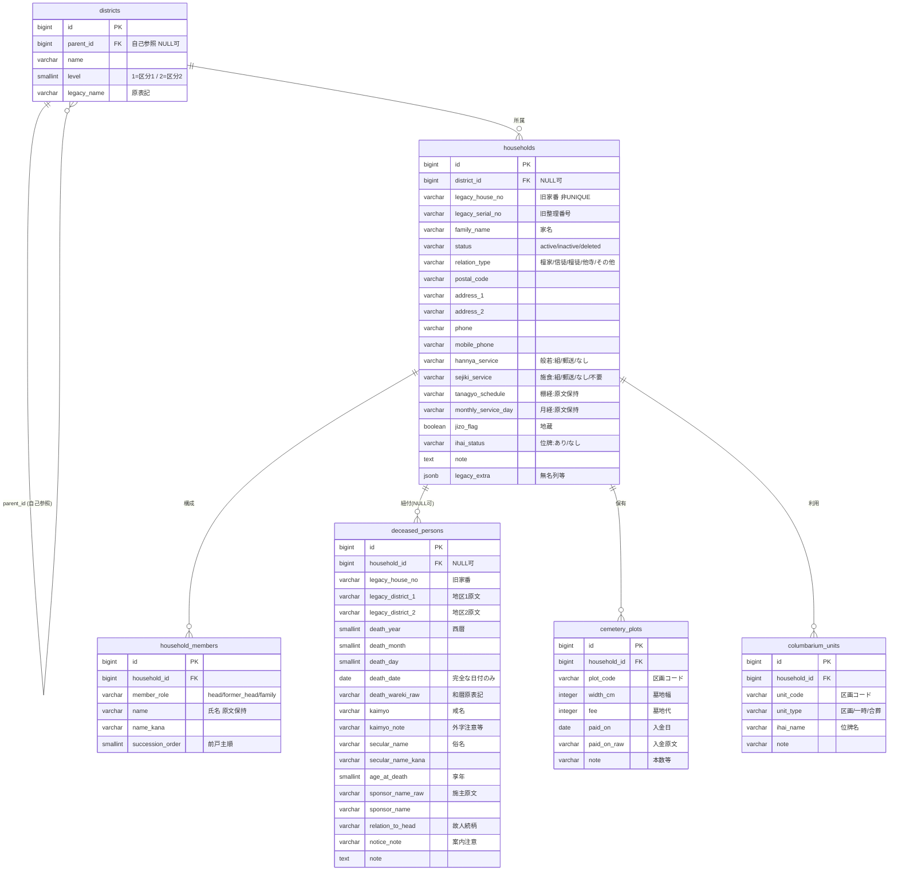

# データモデル設計

## 1. 目的とスコープ

林昌寺の既存実データ（Excel 由来の 2 つの CSV）を、PostgreSQL 上の正規化されたリレーショナルモデルへ移行するためのデータモデルを定義する。

- **入力データ**
  - 檀信徒名簿 CSV: 1,175 行 / 33 列（戸主中心の世帯台帳）
  - 過去帳 CSV: 有効 2,323 行（+ 空スペーサ行 64）/ 14 フィールド（全故人台帳）
- **本書の対象**: エンティティ構成・ER 図・設計判断の根拠・enum 定義。
- **物理カラム定義の詳細**: [テーブル定義書.md](./テーブル定義書.md) を参照。
- **列単位の移行マッピングとクレンジング**: [データ移行設計.md](./データ移行設計.md) を参照。
- **スコープ外**: 預かり情報（`entrusted_items`）の再設計。ただし将来の連携方針を「9. entrusted_items との将来関連」に記す。

## 2. エンティティ一覧

| # | 論理名 | 物理名 | 責務 |
| --- | --- | --- | --- |
| 1 | 地区 | `districts` | 地区区分1→区分2 の階層を自己参照で表現するマスタ |
| 2 | 世帯 | `households` | 家（戸）単位の台帳。連絡先・行事設定・関係区分を内包し、soft delete を持つ |
| 3 | 世帯構成員 | `household_members` | 世帯に属する人物（現戸主・前戸主・家族）。存命人物を表す |
| 4 | 故人 | `deceased_persons` | 過去帳に記録された故人。世帯に紐づく場合と紐づかない場合がある |
| 5 | 墓地区画 | `cemetery_plots` | 世帯が保有する墓地区画。1 世帯が複数区画を持ちうる |
| 6 | 納骨堂区画 | `columbarium_units` | 世帯が利用する納骨堂の区画・一時預かり単位 |

## 3. ER 図

## 4. 各エンティティの責務

### 4.1 districts（地区）
- 名簿の「地区区分1」「地区区分2」を正規化したマスタ。`parent_id` の自己参照で区分1（`level=1`, `parent_id IS NULL`）→区分2（`level=2`, `parent_id` に区分1 を指す）の 2 階層を表現する。
- 名簿の地区区分1 には地区名でない値（削除・墓地・納骨堂・永代・合葬墓・墓地空き 等）が混入している。これらは地区マスタには登録せず、移行時に `households.status` や区画テーブルへ振り分ける（詳細は [データ移行設計.md](./データ移行設計.md) のクレンジング課題）。

### 4.2 households（世帯）
- 家（戸）1 件を 1 行で表す中核テーブル。連絡先（郵便番号・住所・電話・携帯）を持つ。
- **家名（`family_name`）を世帯の属性として持つ**。檀家一覧の主表示・検索キーであり、現行 UI（ParishFamily.name）とも整合する。移行時は名簿「氏名」の全角スペース前トークン（姓）から導出し、単一トークン・氏名欠損（33 世帯）の場合は前戸主の姓から補完、それも無ければ NULL + 要目視（「6.5」参照）。
- **行事設定を内包**する: 般若（`hannya_service`）・施食（`sejiki_service`）・棚経（`tanagyo_schedule`）・月参り日（`monthly_service_day`）・地蔵（`jizo_flag`）。理由は「6. 設計判断」を参照。
- `status` による soft delete。名簿地区区分1 の「削除」172 件を `status='deleted'`、住所2 に「離檀」メモがある世帯（8 件）を `status='inactive'` として保持する。
- 旧家番（`legacy_house_no`）・旧整理番号（`legacy_serial_no`）を移行参照用に保持。UNIQUE 制約は付けない（家番は重複・欠損があるため。「6.4 legacy キー方針」参照）。
- 現戸主・前戸主・家族といった「人物」は `household_members` に分離する（現戸主氏名は `member_role='head'` の構成員が担い、世帯側は家名のみ持つ）。

### 4.3 household_members（世帯構成員／存命人物）
- 1 世帯に属する存命人物を表す。`member_role` で役割を区別する。
  - `head`: 現戸主（名簿「氏名」由来。世帯あたり最大 1 件）
  - `former_head`: 前戸主（名簿「前戸主1〜4」由来。`succession_order` に 1〜4）
  - `family`: 家族（名簿「家族1」由来）
- **氏名は姓・名に分割せず、`name` 1 カラムに原文保持する**（理由は「6.5」参照）。フリガナ（`name_kana`）は名簿でセイ・メイ結合の半角カナのため、現戸主にのみ全角カナへ正規化して保持する。
- 家名（姓）での検索は `households.family_name` が担い、構成員は `name` の部分一致検索で補完する。
- 世帯あたり現戸主 1 件制約は部分 UNIQUE インデックスで表現する（詳細は [テーブル定義書.md](./テーブル定義書.md)）。

### 4.4 deceased_persons（故人）
- 過去帳の故人 1 名を 1 行で表す。存命人物（`household_members`）とは別テーブルに分離する（「6.1」参照）。
- `household_id` は NULL 可。過去帳の家番 8888（57 件・意味不明）や「削除」「抹消」「空」の行は、対応世帯を特定できないため FK を NULL とし、`legacy_house_no` に原値を保持する。
- 過去帳の地区1・地区2 は `legacy_district_1` / `legacy_district_2` に **原文保持** する。画面表示は世帯経由（`households.district_id`）の導出を優先し、FK NULL の孤立故人（300 件超）のみ legacy 値を表示する。移行で情報を捨てないための措置（正式な扱いは要ヒアリング）。
- **年忌カラムは持たない**。年忌（一周忌・三回忌 …）は没年月日と基準年から機械的に導出できるため、特定年（令和8年）時点のスナップショットである原データの「年忌」列は保持しない。
- 不完全な没日付に対応するため、`death_year` / `death_month` / `death_day` を個別に保持し、3 つが揃う場合のみ `death_date`(DATE) を導出格納する。和暦は原表記（`death_wareki_raw`）を保存する。
- 戒名の外字・変体仮名注意は `kaimyo_note`、法要案内上の注意は `notice_note` に分離する。
- 施主は「河合　博元　妻」形式（施主名＋故人続柄）のため、原文を `sponsor_name_raw` に残しつつ `sponsor_name`（施主氏名）と `relation_to_head`（施主から見た故人続柄）へ分割する。

### 4.5 cemetery_plots（墓地区画）
- 世帯が保有する墓地区画を 1 区画 1 行で表す。区画コード（例: 東北２２Ｂ）・幅・代金・入金日・備考（本数等）を持つ。
- 名簿「墓地区分」が「なし」または空の世帯は **行を作らない**（NULL 混用の解消。「6.3」参照）。

### 4.6 columbarium_units（納骨堂区画）
- 世帯が利用する納骨堂の区画・一時預かりを 1 単位 1 行で表す。`unit_type` で区画／一時／合葬を区別する。
- 名簿「納骨堂区分」が「なし」または空の世帯は **行を作らない**。

## 5. enum 定義（VARCHAR + CHECK 制約）

enum は VARCHAR + CHECK で表現する。各候補値の意味と CSV 実測分布（名簿 1,175 行 / 過去帳基準）を併記する。クレンジングで吸収する表記ゆれも記載する。

### 5.1 households.status
| 値 | 意味 | 実測分布 |
| --- | --- | --- |
| `active` | 有効な世帯（既定） | 「削除」「離檀」以外の全件（≒995）|
| `inactive` | 離檀等で関係終了（記録は保持） | 住所2 に「離檀」メモ = 8（例「令和4年2月離檀」）|
| `deleted` | 論理削除済み | 地区区分1「削除」= 172 |

> `inactive` は承認プランの enum 案（active/inactive/deleted）を踏襲。現データで直接の出所は名簿住所2 の「離檀」メモ 8 件のみのため、移行時は目視確認のうえ振り替え、メモ原文は `address_2`/`note` に保持する。

### 5.2 households.relation_type（名簿「関係」）
| 値 | 意味 | 実測分布 |
| --- | --- | --- |
| `檀家` | 檀家 | 601 |
| `信徒` | 信徒 | 120 |
| `檀徒` | 檀徒 | 102（+ 表記ゆれ「壇徒」1 を吸収）|
| `他寺` | 他寺 | 54 |
| `その他` | その他 | 18 |
| （NULL） | 未設定 | 279 |

### 5.3 households.hannya_service（名簿「般若」）
| 値 | 意味 | 実測分布 |
| --- | --- | --- |
| `組` | 組回り | 403 |
| `郵送` | 郵送 | 269 |
| `なし` | なし | 1 |
| （NULL） | 未設定 | 502 |

### 5.4 households.sejiki_service（名簿「施食」）
| 値 | 意味 | 実測分布 |
| --- | --- | --- |
| `組` | 組回り | 1 |
| `郵送` | 郵送 | 409 |
| `なし` | なし | 19（+「不要」1 を吸収するか要ヒアリング）|
| `不要` | 不要 | 1 |
| （NULL） | 未設定 | 745 |

### 5.5 households.ihai_status（名簿「位牌区分」）
| 値 | 意味 | 実測分布 |
| --- | --- | --- |
| `あり` | 位牌あり | 641 |
| `なし` | 位牌なし | 344（+ 表記ゆれ「なし「」1 を吸収）|
| （NULL） | 未設定 | 188（+「？？」1 は要確認で NULL 化）|

### 5.6 households.jizo_flag（名簿「地蔵」・BOOLEAN）
| 値 | 意味 | 実測分布 |
| --- | --- | --- |
| `true` | 地蔵あり（原値「地蔵」）| 27 |
| `false` | なし（既定・空欄）| 1,148 |

### 5.7 household_members.member_role
| 値 | 意味 | 由来列 / 実測件数 |
| --- | --- | --- |
| `head` | 現戸主 | 「氏名」（世帯ごと最大1）|
| `former_head` | 前戸主 | 前戸主1=666 / 2=236 / 3=41 / 4=2 |
| `family` | 家族 | 「家族1」= 197 |

### 5.8 columbarium_units.unit_type（名簿「納骨堂区分」から導出）
| 値 | 意味 | 実測目安 |
| --- | --- | --- |
| `区画` | 区画コードあり（例: 北い１３ー４）| コード/メモ計 592（要クレンジング）|
| `一時` | 一時預かり（原値「一時」「一時◯◯迄」）| 16+ |
| `合葬` | 合葬（「観音下に合葬」等）| 少数 |

> 「なし」418・空 145・「あり」4・「返還」2 等の扱いは [データ移行設計.md](./データ移行設計.md) のクレンジング課題で定義する。

### 5.9 deceased_persons.relation_to_head（過去帳「施主」から分割）
自由記述の続柄（妻・父・母・夫・兄・義父 等）。固定 enum ではなく分割抽出した文字列を保持する。原文は `sponsor_name_raw` に残す。

## 6. 設計判断の根拠

### 6.1 存命人物と故人の分離 vs 統一 persons

| 観点 | 分離案（採用）| 統一 persons 案 |
| --- | --- | --- |
| 属性の共通性 | 存命=連絡先・続柄・戸主順、故人=戒名・没日・享年・施主。共通属性が少ない | 共通属性が氏名程度で、片方だけ NULL の列が大量に発生 |
| データ源 | 名簿（世帯台帳）と過去帳（故人台帳）で source が明確に分かれる | 2 source を 1 テーブルに混載、由来が曖昧化 |
| ライフサイクル | 存命は世帯必須、故人は世帯 NULL 可。制約が異なる | is_deceased フラグ + 条件付き制約が複雑化 |
| 件数・成長 | 故人 2,300+ は追記型、存命は世帯編集型でアクセスパターンが異なる | インデックス・キャッシュ効率が落ちる |
| 移行の単純さ | 名簿→members、過去帳→deceased と 1:1 に近く検証容易 | 名寄せ（同一人物判定）が必要で移行難度が上がる |

→ 属性・source・ライフサイクル・制約がいずれも異なり、統一の利点（同一人物の一元管理）は現データに名寄せキーが無く享受できない。よって **分離を採用**。将来「戸主が故人化した際に members→deceased へ引き継ぐ」運用は、両テーブルに `legacy_house_no` を持たせることで後付け連携可能。

### 6.2 行事設定を households に内包した理由
- 般若・施食・棚経・月経・地蔵はいずれも **世帯に対して単一値**（世帯ごとに 1 つの区分／予定）であり、名簿でも 1 世帯 1 列で管理されている。
- 別テーブル（household_services 等）へ切り出すと、常に 1:1 で JOIN が増えるだけで正規化上の利得（重複排除・多重度）が無い。
- 行事の「実施履歴（いつ回ったか）」を管理する要件が出た段階で初めて別テーブル化すべきで、現データは設定値のみ。よって households 内包が妥当。棚経・月経は表記が多様（月日文字列・複雑値）なため原文を VARCHAR で保持する。

### 6.3 区画テーブル（cemetery_plots / columbarium_units）を分離した理由
- 名簿の「墓地区分」「納骨堂区分」は、区画コード（東北２２Ｂ / 北い１３ー４）・「なし」・「一時」・メモが **同一セルに混用** されている。households に 1 列で持つと「なし＝行あり値なし」なのか「未設定」なのか区別できず、区画コードの検索・一意性も担保できない。
- 家番の重複（0749×5 等、計 9 家番）は「同一家が複数区画を持つ」ケースの可能性が高い。1 世帯 : 多区画を表現するには区画を子テーブルに分離するのが自然。
- 「なし」「空」は **行を作らない** ことで「区画を持たない世帯」を「該当行なし」で自然に表現し、NULL 混用を解消する。幅・代金・入金日・本数といった区画固有の属性も区画行に集約できる。

### 6.4 legacy キー方針
- 全テーブルの PK は surrogate key（`BIGSERIAL`）。業務識別子（家番・整理番号）を PK にしない。
- 旧家番は `households.legacy_house_no` / `deceased_persons.legacy_house_no`、旧整理番号は `households.legacy_serial_no` として保持。移行後の突合・監査に用いる。
- これらに UNIQUE を **付けない**。理由: 家番は欠損 164・重複 9 家番（0749×5 含む）・過去帳側に 8888/削除/空が存在し、業務的に一意でないため。UNIQUE を課すと移行が破綻する。

### 6.5 氏名を姓・名に分割しない判断と households.family_name
- **`household_members` の氏名は分割せず `name` 1 カラムに原文保持する。**
- 実データ上、機械分割は成立しない:
  - 名簿「氏名」1,142 件のうち **単一トークン（全角スペースなし）が 100 件**。名のみ（「あき７３２」）・スペースなしフルネーム（「長尾有紀子」「長谷川シズヱ」）・家名のみ（「岩田家」「村井」）・記号混入（「徳田（張判守」「墓標０２」）が混在し、姓/名の判別に全件目視が必要になる。
  - 「家族1」197 件は **90 件が単一トークンでほぼ名のみ**（峰子・和子等）。分割案では姓カラムが埋まらず、家名検索が構造的に漏れる。
  - 氏名欠損が 33 世帯あり、head 行に依存すると家名が完全に取得不能になる。
- そこで家名は世帯の属性として `households.family_name` に持つ（檀家一覧の主表示・検索キー。現行 UI の ParishFamily.name と整合）。移行規則: 氏名の全角スペース前トークン（姓）から導出 → 単一トークン・欠損時は前戸主の姓から補完（補完可能なのは実測 1 世帯のみ）→ それも無ければ NULL + 要目視。
- 分割の目視コスト（100 件超の判定作業）に対し、得られる利得は乏しい（宛名印字等の要件が出た時点で分割を再検討すればよい）。なお `deceased_persons.sponsor_name` は「施主氏名＋続柄」の構造分割（末尾トークンの続柄除去）であり、姓名分割ではないため影響しない。

## 7. インデックス・制約方針（概要）
- 検索対象: 家名（`households.family_name`）・構成員氏名（`household_members.name`）・カナ（`name_kana`）・地区（`households.district_id`）・戒名（`deceased_persons.kaimyo`）・俗名（`secular_name`）・没年月日（`death_year`/`death_date`）。これらに B-tree インデックスを付与。
- 現戸主 1 世帯 1 件は部分 UNIQUE インデックス `UNIQUE(household_id) WHERE member_role='head'` で表現。
- 具体的なカラム・型・CHECK・インデックス定義は [テーブル定義書.md](./テーブル定義書.md) に記載する。

## 8. enum 一覧サマリ
| テーブル.カラム | 種別 | 候補値 |
| --- | --- | --- |
| households.status | CHECK | active / inactive / deleted |
| households.relation_type | CHECK | 檀家 / 信徒 / 檀徒 / 他寺 / その他 |
| households.hannya_service | CHECK | 組 / 郵送 / なし |
| households.sejiki_service | CHECK | 組 / 郵送 / なし / 不要 |
| households.ihai_status | CHECK | あり / なし |
| household_members.member_role | CHECK | head / former_head / family |
| columbarium_units.unit_type | CHECK | 区画 / 一時 / 合葬 |
| districts.level | CHECK | 1 / 2 |

## 9. entrusted_items との将来関連
- 預かり情報（`entrusted_items`）は本設計のスコープ外だが、既存定義書に俗名・戒名・死亡年月日を持つ。これらは本質的に **故人に関する情報** である。
- 将来的に `entrusted_items` に `deceased_person_id`(BIGINT, FK → `deceased_persons.id`, NULL 可) を追加し、預かり対象の故人を `deceased_persons` と正規化連携させることを想定する。これにより戒名・俗名・没日を `deceased_persons` に一元化し、`entrusted_items` は預かり固有情報（保管場所・預り年月日）に専念できる。
- 本移行フェーズでは `entrusted_items` は現状維持とし、連携カラムの追加は別フェーズで行う。
