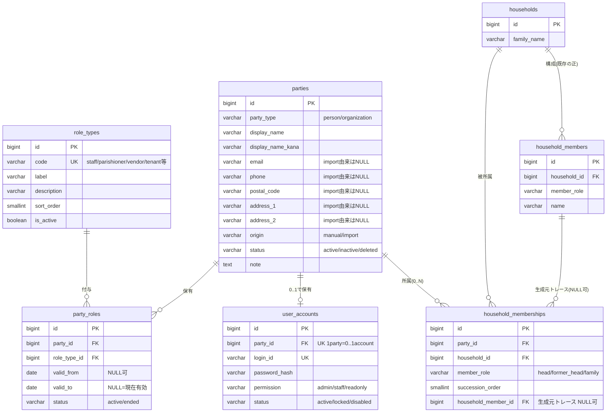
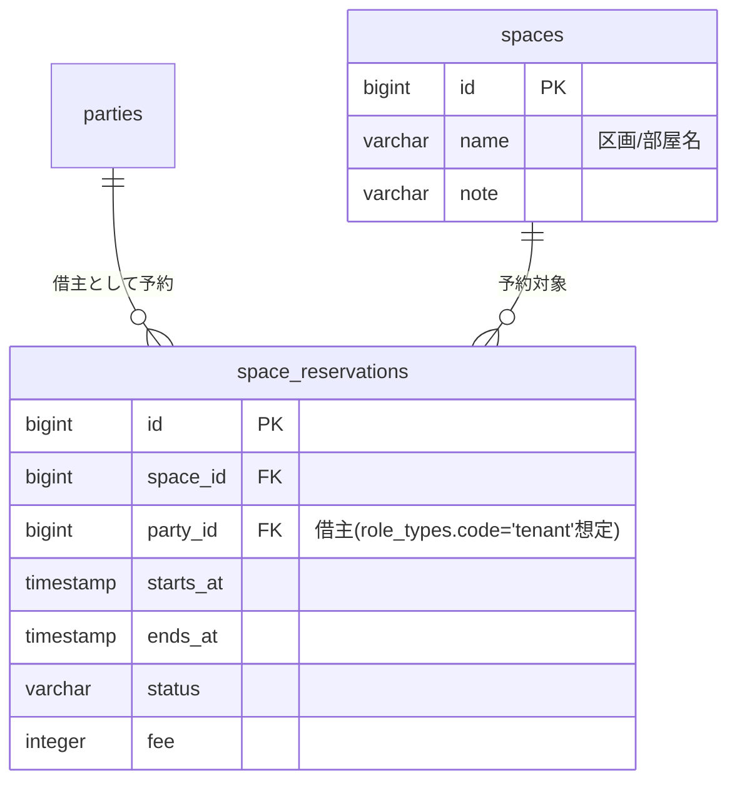
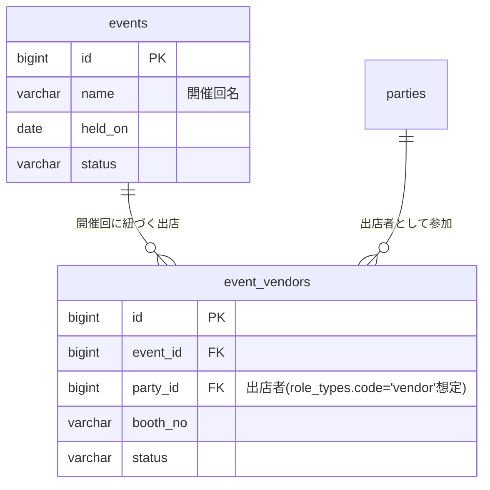

# パーティモデル設計

檀信徒管理を出発点に「寺と関わる主体」を統一的に扱うための拡張モデル（`parties` 系 5 テーブル）を定義する。既存の [データモデル設計.md](./データモデル設計.md) を土台に、本書ではパーティモデル固有の設計判断・ER・将来拡張のみを扱う。物理カラム定義は [テーブル定義書.md](./テーブル定義書.md) 「7.〜11.」、移行時のパーティ生成規則は [データ移行設計.md](./データ移行設計.md) 「フェーズ③」を参照。

- **DDL の正**: 本書は設計判断の記録であり、カラム名・制約名・型は `db/init/01_schema.sql`（実装）およびテーブル定義書と矛盾しない。矛盾が生じた場合は DDL・テーブル定義書を正とする。

## 1. 目的・背景

現行システムのユーザー概念は「檀家（世帯構成員）」と「寺事務員」のみを想定していた。しかし今後、次のようなステークホルダー拡張が見込まれている。

- 檀信徒向けの専用画面（檀信徒がログインして自分の家の情報・年忌案内を閲覧する等）
- 寺スペースの間貸し（会場・部屋を外部に貸し出す利用者）
- マルシェ等イベントの開催（出店者との関係管理）

これらはいずれも「寺と関わる人・組織」という点で共通するが、既存の `households` / `household_members` は檀信徒の世帯台帳としての責務に最適化されており、上記のような多様な関係主体やログインアカウントを表現する余地がない。そこで、人・組織を統一的に扱う台帳として **パーティモデル**（`parties` / `role_types` / `party_roles` / `user_accounts` / `household_memberships`）を導入する。

なお本システムは林昌寺専用に閉じたものではなく、将来的に他寺院へテンプレートとして展開し、寺院ごとに個別最適化する運用を想定している。単一寺院前提（`temple_id` 等のテナント分離カラムは持たない）である一方、**寺院ごとに増減しうる業務ロールをスキーマにハードコードしない**（詳細は「4.1」）という制約が、本モデルの設計に強く影響している。

## 2. ステークホルダー拡張の考え方

パーティモデル導入前後で、システムが扱う「主体」の捉え方は次のように変わる。

| 観点 | 導入前 | 導入後 |
| --- | --- | --- |
| 中心概念 | 檀信徒（世帯構成員）と寺事務員という 2 種の別概念 | 「寺と関わる主体（パーティ）」という統一概念。檀信徒・寺事務員はその一種 |
| 新ステークホルダー追加時の作業 | 新概念ごとに個別テーブル・個別画面ロジックの新設が必要になりがち | `role_types` に行を 1 件追加するだけで新しい「役割」を表現できる（スキーマ変更不要） |
| アカウント（ログイン）との関係 | 寺事務員のみが暗黙的にアカウントを持つ想定 | `user_accounts` は `parties` に対して 0..1 で付与。役割を問わず「アカウントを持つ主体」を統一的に扱える |

檀信徒中心の設計から「寺と関わる主体の統一台帳」への拡張、という位置づけであり、既存の檀信徒管理（`households` / `household_members`）を置き換えるものではない（詳細は「4.5」）。

## 3. ER 図

- `households` / `household_members` は既存エンティティ（詳細属性は [データモデル設計.md](./データモデル設計.md) 「3. ER 図」参照）。ここでは接続関係を示すため主要カラムのみ再掲する。
- `party_roles` は「パーティ⇔ロール種別」の多対多＋有効期間。`valid_to IS NULL` かつ `status='active'` の行が「現在有効」（`party_id, role_type_id` の組で一意）。
- `household_memberships` は「パーティ⇔世帯」の接続。`household_member_id` は並存期の生成元トレース・突合検証専用で、業務的な正ではない。

## 4. 設計判断

> 各判断の経緯は [ADR](../ADR/README.md)（0006〜0009）を参照。

### 4.1 ロールのマスタテーブル化 vs CHECK 制約

業務ロール（寺務員・檀信徒・出店者・利用者…）を `role_types` テーブル（データ）で持つか、`party_roles.role_type` を VARCHAR + CHECK 制約（スキーマ）で持つかを比較した。

| 観点 | `role_types` マスタ化（採用） | CHECK 制約案 |
| --- | --- | --- |
| 他寺院テンプレ展開時の追加コスト | `INSERT` のみ。無停止で追加可能 | `ALTER TABLE ... ADD CONSTRAINT` が必要。リリースを伴う |
| 既存データへの影響 | 影響なし（既存 `party_roles` 行はそのまま） | 制約変更時に既存値との整合性チェックが必要 |
| 表示順・説明文の管理 | `sort_order` / `label` / `description` 列で一元管理 | アプリ側コードにハードコードが必要 |
| 不正値の防止 | FK 制約（`fk_party_roles_role_type`, `ON DELETE RESTRICT`）で担保 | CHECK 制約で担保。防止力は同程度 |
| ロールの無効化 | `is_active=false` で論理無効化。履歴（`party_roles` の過去行）は保持されたまま表示から除外できる | 値を削除できない（既存行が参照している値を CHECK から外せない） |

**採用理由**: 本システムはテンプレート化して他寺院へ個別最適化して展開する想定であり、業務ロールは「その寺固有の運用に左右されるデータ」である。これをスキーマ（CHECK 制約）にハードコードすると、寺院ごとの役割の違い（例: ある寺には「利用者」ロールが不要、別の寺には「役員」ロールが必要）に対応するたびにマイグレーションが発生する。データとして持てば `INSERT` だけで済む。

**システム enum との使い分け基準**: `party_type`（person/organization）・`parties.status` / `party_roles.status`・`user_accounts.permission` / `status` は従来どおり VARCHAR + CHECK のままとする。これらは **コードが if/switch で直接分岐に使う、寺院間で変わらない不変な値** だからである。一方 `role_types` のように **寺院ごとに増減・カスタマイズされうる「業務データ」的な値** はマスタテーブル化する。この基準は既存の `districts`（地区マスタ）や `import_records.source_file`（CHECK のまま。移行元ファイル種別はシステム固有で変わらない）とも整合する。

### 4.2 業務ロールと認可権限（permission）の分離

`party_roles`（＝ `role_types` が表す「その人が寺との関係で何者か」という業務データ）と、`user_accounts.permission`（admin/staff/readonly、＝「システムに何をしてよいか」という認可）は、**直交する別概念**として分離する。

- 業務ロールは 0..N（同一パーティが `staff` と `vendor` を兼ねる等もあり得る）。認可権限はアカウントごとに 1 つ（`user_accounts.permission` は単一値の CHECK 列）。
- この分離により、例えば「`staff` ロールを持つが `readonly` 権限の職員」「将来 `parishioner` ロールで `readonly` 権限の檀信徒ポータルアカウント」といった組み合わせが、スキーマ変更なしに表現できる。
- `permission` はフロント（`SectionStaff.tsx` の admin/staff/readonly 判定）と直接対応するシステム enum のため、role_types 化の対象外とし CHECK 制約のまま維持する（「4.1」の使い分け基準どおり）。

### 4.3 連絡先の正の所在

檀信徒の連絡先（郵便番号・住所・電話）の正は、従来どおり `households` である。`parties` にも同名の連絡先カラム（`email` / `phone` / `postal_code` / `address_1` / `address_2`）を持つが、**`origin='import'` の parties ではこれらをすべて NULL で生成する**（「4.4」参照）。これにより「世帯の連絡先」と「パーティの連絡先」が二重に更新され食い違う事態を、そもそも import 由来データでは発生させない。

`parties` の連絡先カラムは、`origin='manual'` のパーティ（寺務員個人の連絡先、出店者・借主の連絡先等、世帯に属さない主体）専用の値として使う。

**将来の優先規則（フェーズ2 以降）**: 読み取りを `parties` 経由に切り替える際、檀信徒系パーティ（`household_memberships` を持つ party）に連絡先が個別入力された場合は「party 個別値 > 世帯（households）」を優先する規則を想定する。ただし本フェーズでは import 由来 party の連絡先は常に NULL のため、この優先規則が意味を持つケースは発生しない（将来 manual party に連絡先が入力されて初めて有効になる）。

### 4.4 origin（manual/import）による洗い替え共存の仕組み

`parties.origin` は、そのパーティ行がどこから来たかを表し、**洗い替え可否の境界線**として機能する。

| origin | 生成元 | 正の所在 | 洗い替え |
| --- | --- | --- | --- |
| `import` | `household_members` から機械生成された派生データ | `household_members` 側が正。`parties` 側は読み取り専用 | 移行フェーズ③で **全削除 → 全再生成**（冪等） |
| `manual` | 寺務員による手入力（寺務員本人・出店者・借主等） | `parties` 側が正 | 洗い替え不可侵。フェーズ③の削除処理から除外 |

同一テーブル内に「洗い替えられる行」と「洗い替えられない行」が共存するため、フェーズ③の削除は `WHERE origin='import'` に限定する。さらに **`user_accounts` は `origin='manual'` のパーティにのみ付与する運用ルール**とすることで、削除時に「import 由来なのにログインアカウントが紐づいている」という事故を避けるガード（削除前に `user_accounts` の存在チェックし、存在すれば警告して削除対象から除外）を設ける（詳細は [データ移行設計.md](./データ移行設計.md) 「フェーズ③」）。

### 4.5 household_members との関係

檀信徒人物の「正」である `household_members` と、新設の `parties` をどう関係づけるかについて 3 案を比較した。

| 案 | 内容 | 評価 |
| --- | --- | --- |
| **案A: 即統合** | `household_members` を廃止し、`parties` + `household_memberships` に完全移行する | 既存の全画面ロジック（檀家一覧・過去帳・年忌案内等）を同時に書き換える必要があり、移行リスクが大きい。ステークホルダー拡張という当面のスコープに対して過剰 |
| **案B: 並存 + 派生生成（採用）** | `household_members` を正として維持したまま、`parties` を並存させる。`origin='import'` の parties は `household_members` から機械生成する読み取り専用の派生データとする | 既存機能・UI への影響を最小化しつつ、`origin='manual'` のパーティ（寺務員アカウント・将来ステークホルダー）を先行導入できる。統合は将来フェーズへ先送りできる |
| **案C: トリガ同期** | `household_members` の INSERT/UPDATE/DELETE を DB トリガで検知し、`parties` / `household_memberships` へリアルタイム同期する | 常時同期の実装・保守コストが高く、トリガの障害時に静かにデータがずれるリスクがある。今フェーズで即時同期が必要な要件（例: 檀信徒ログイン即時反映）はまだ無い |

**採用理由**: 案B。既存の檀信徒管理機能を一切変更せずに新ステークホルダー（寺スペース間貸しの借主・マルシェ出店者・寺務員アカウント等）を扱えるようにすることが今回のスコープであり、案A・案Cのコスト・リスクに見合う要件がまだない。移行フェーズ③で `household_members` 全行から `parties`（`origin='import'`）・`household_memberships`・`party_roles`（`parishioner`）を機械生成することで、統合に必要なデータ形だけを先行して用意する。

**将来統合パス**:
- **フェーズ2**: 檀信徒参照系の「読み取り」を `household_members` 直接参照から `parties` 経由（`parties` ⇔ `household_memberships` ⇔ `households`）に切り替える。書き込みはまだ `household_members` が正のまま。
- **フェーズ3**: 「書き込み」も `parties` / `household_memberships` に一本化し、`household_members` を廃止する。この時点で `member_role` / `succession_order` の値・意味を `household_memberships` と揃えてある（本 DDL 仕様の設計方針）ため、変換ロジックなしに移行できる。

### 4.6 二重管理リスクと封じ込めルール

`household_members`（正）と `parties`（`origin='import'` は派生）が並存する期間、二重管理・不整合のリスクが生じる。これを次のルールで封じ込める。

- **import 由来 parties は読み取り専用**: アプリケーション・移行スクリプトのいずれも `origin='import'` の `parties` / `party_roles` / `household_memberships` 行を直接更新しない。更新が必要な場合は `household_members` 側を更新し、フェーズ③の再生成で反映する。
- **檀信徒参照機能は当面 `household_members` 起点のまま**: 檀家一覧・過去帳・年忌案内等の既存画面は、本フェーズでは `parties` 経由に切り替えない（「4.5」フェーズ2 で初めて切り替える）。`household_memberships` / `party_roles`（parishioner）は、現時点では移行検証・将来統合の足場としてのみ存在し、画面ロジックの入力にはしない。
- **冪等な全削除・全再生成**: `origin='import'` の parties は「全削除 → 全再生成」でのみ更新する（差分更新はしない）。これにより「機械生成データがどう変化したか」を個別に追跡する必要がなくなり、`household_members` との不整合が蓄積しない。

## 5. 将来拡張（骨格のみ・DDL 未実装）

以下はいずれも **本フェーズの DDL には含まれない**。パーティモデルが「新ステークホルダー追加 = `role_types` に行を足すだけ」で拡張可能であることを示す骨格として記す。実装時は本書とは別に個別の設計判断（キャンセルポリシー・課金・重複予約制御等）が必要になる。

### 5.1 間貸し（スペース貸出）

- `spaces`: 貸し出し可能な区画・部屋のマスタ。
- `space_reservations`: 予約 1 件 = 1 行。`party_id` で `parties` に接続し、借主が誰であるかを表す（`role_types.code='tenant'` を想定）。

### 5.2 マルシェ（イベント出店）

- `events`: マルシェ等の開催回マスタ。
- `event_vendors`: 開催回ごとの出店 1 件 = 1 行。`party_id` で `parties` に接続し、出店者が誰であるかを表す（`role_types.code='vendor'` を想定）。

いずれも新しい主体は既存の `parties` テーブルに `party_type='person'` または `'organization'`・`origin='manual'` として登録し、`role_types` に対応する行（`tenant` / `vendor`）を追加したうえで `party_roles` を付与する、という共通パターンで扱える（「2. ステークホルダー拡張の考え方」参照）。
